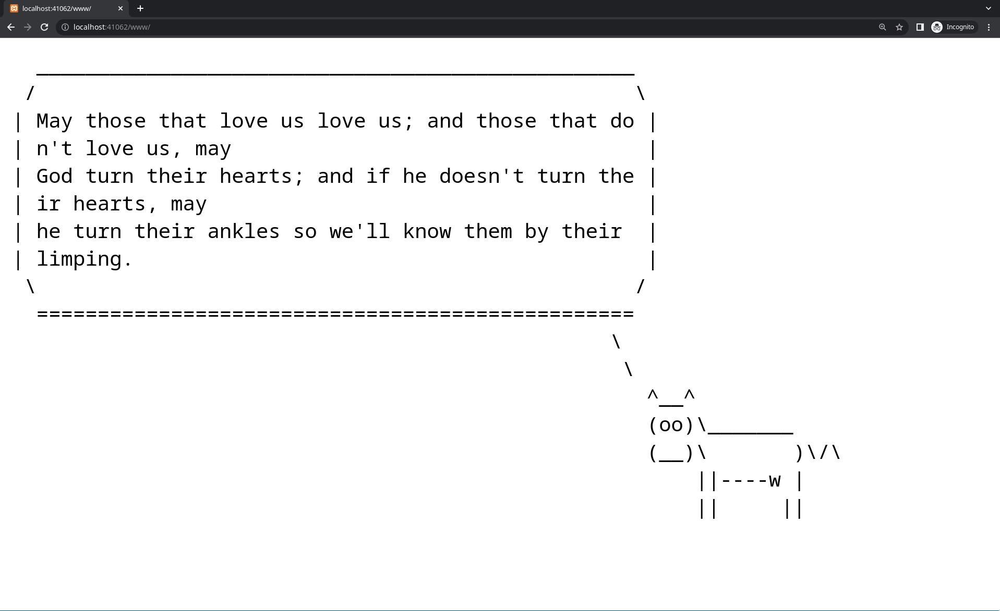

# Docker composed fortune cowsay

A static website application shows a ASCII cow saying a random fortune, base on docker-compose.



Docker composes two separate part of service:

1. A Python Flask server to produce cowsay and fortune string
2. A Xampp server host a website

## Requirements

- Docker
- Docker-compose

## Usage

First run this command

```console
$ docker compose up
```

Then navigate your web browser to `localhost:41062/www` and enjoy the wisdom of cow!

(you can append `?char=trex` to the URL to summon a T-Rex!)

To close server, push \<Ctrl-C> to stop containers. After containers are stopped, use command below to teardown them

```console
$ docker compose down
```

## Components

- Xampp container is comming from [tomsik68's work](https://github.com/tomsik68/docker-xampp).
- Python's [cowsay](https://github.com/VaasuDevanS/cowsay-python) and [fortune](https://github.com/James-Ansley/fortune) are also not my work.
